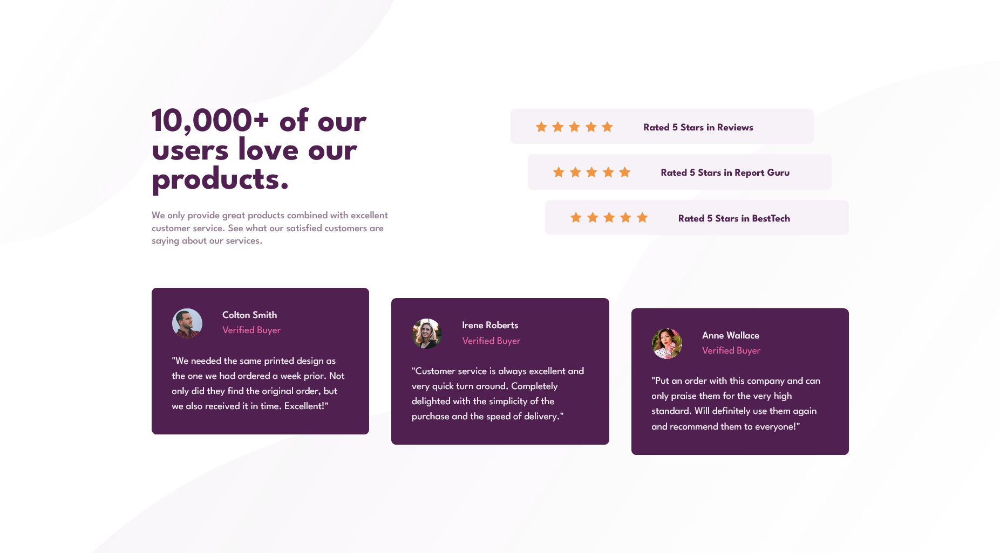

# Frontend Mentor - Social Proof Section Solution

This is a solution to the [Social Proof Section Challenge on Frontend Mentor](https://www.frontendmentor.io/challenges/social-proof-section-6e0qTv_bA). Frontend Mentor challenges help you improve your coding skills by building realistic projects. 

## Table of contents

- [Overview](#overview)
  - [The challenge](#the-challenge)
  - [Screenshot](#screenshot)
  - [Links](#links)
- [My process](#my-process)
  - [Built with](#built-with)
  - [What I learned](#what-i-learned)
  - [Continued development](#continued-development)
  - [Useful resources](#useful-resources)

## Overview

### The challenge

Users should be able to:

- View the optimal layout for the section depending on their device's screen size

### Screenshot

### Links

- [Solution](https://www.frontendmentor.io/solutions/responsive-social-proof-section-using-css-flex-grid-and-js-EaRHHHQJsX)
- [Live Site](https://spiffy-mermaid-a79db8.netlify.app/)

## My process

### Built with

- Semantic HTML5 markup
- CSS Custom Properties
- CSS Flex
- CSS Grid
- JavaScript
- Mobile-first workflow

### What I learned

Working with SVGs is a Pain?? I couldn't figure out the overflow 🙃 Although, I am proud of the fact that I used JS to add in the stars instead of hardcoding them!!

### Continued development

I need to look up some resources specifically targeted to using SVGs. Something like an SVGpedia?

### Useful resources

I had to dip into the [MDN Web Docs](https://developer.mozilla.org/en-US/) because I somehow forgot the grid shorthand LMAO